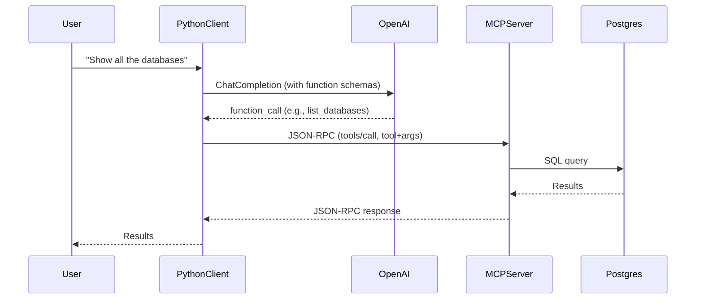

# MCP PostgreSQL Server + OpenAI Python Client Documentation

---

## 1. Overview

This setup allows you to:
- Use natural language (via OpenAI GPT-4 function calling) to interact with a PostgreSQL database.
- The OpenAI model chooses the correct database operation (function/tool).
- A Python client bridges OpenAI and the MCP server, translating function calls into JSON-RPC requests.
- The MCP server executes the request on PostgreSQL and returns the result.

---

## 2. How It Works (Architecture)



---

## 3. How to Start the MCP Server

1. **Install dependencies and build:**
   ```sh
   npm install
   npm run build
   ```

2. **Start the server:**
   ```sh
   npm start
   ```
   - The server will run on stdio (standard input/output).
   - You'll see:  
     `PostgreSQL MCP server running on stdio`

---

## 4. How to Use the Python Client

### A. Prerequisites

- Python 3.8+
- `openai` and `python-dotenv` packages:
  ```sh
  pip install openai python-dotenv
  ```
- A `.env` file in your project root:
  ```
  OPENAI_API_KEY=sk-your-openai-key-here
  ```

### B. Run the Client

```sh
python openai_mcp_bridge.py
```

### C. Example Interaction

- You'll be prompted:
  ```
  Ask your database question:
  ```
- Type:
  ```
  show all the databases
  ```
- Output:
  ```
  OpenAI chose function: list_databases with args: {}
  MCP Result: {
    "result": {
      "content": [
        {
          "type": "text",
          "text": "Query executed successfully. Retrieved 3 rows.\n\nResults:\n[\n  {\n    \"datname\": \"postgres\"\n  },\n  {\n    \"datname\": \"template1\"\n  },\n  {\n    \"datname\": \"template0\"\n  }\n]"
        }
      ]
    },
    ...
  }
  ```

---

## 5. Client Logic Explained

1. **User Input:**  
   The user types a natural language question.

2. **OpenAI Function Calling:**  
   The client sends the question and a set of function schemas (e.g., `list_users`, `run_query`, `list_databases`) to OpenAI's GPT-4 model.

3. **Function Selection:**  
   OpenAI chooses the most appropriate function and provides arguments (if any).

4. **Mapping to MCP Tool:**  
   The client maps the function name to the correct MCP tool and arguments.

5. **JSON-RPC Request:**  
   The client spawns the MCP server as a subprocess and sends a JSON-RPC request (with tool name and arguments) via stdin.

6. **MCP Server Execution:**  
   The MCP server receives the request, executes the tool (e.g., runs a SQL query), and returns the result as JSON.

7. **Result Display:**  
   The client prints the result for the user.

---

## 6. How to Extend

- **Add More Functions:**  
  Add new function schemas and mappings in `openai_mcp_bridge.py` for more database operations (e.g., create table, insert row, etc.).

- **Improve Output:**  
  Parse and format the MCP result for prettier display.

- **Support More Tools:**  
  Check the MCP server's available tools and add schemas for any you want to expose.

---

## 7. Example: Adding a New Function

To add a function for listing tables:
- Add to `function_schemas`:
  ```python
  {
      "name": "list_tables",
      "description": "List all tables in the current database.",
      "parameters": {
          "type": "object",
          "properties": {},
          "required": []
      }
  }
  ```
- Add to `function_to_mcp`:
  ```python
  "list_tables": ("pg_execute_query", {"operation": "select", "query": "SELECT tablename FROM pg_tables WHERE schemaname NOT IN ('pg_catalog', 'information_schema')"}),
  ```

---

## 8. Troubleshooting

- **API Key Not Found:**  
  Ensure `.env` is in the same directory and contains the correct key.

- **No Results:**  
  The database may be empty, or the query/tool may not match your intent. Add more explicit function schemas.

- **Wrong Function Chosen:**  
  Make function descriptions more specific, or add more functions for common tasks.

---

## 9. References

- [OpenAI Function Calling Docs](https://platform.openai.com/docs/guides/function-calling)
- [MCP Protocol](https://smithery.ai/docs/mcp/)
- [PostgreSQL MCP Server GitHub](https://github.com/HenkDz/postgresql-mcp-server)

---

If you want to further extend this documentation or automate more workflows, just ask! 