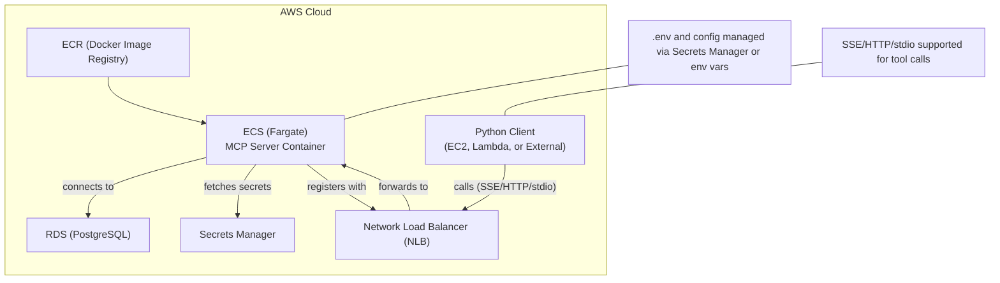

# PostgreSQL MCP Server & Python Client: Complete Guide

## Overview
This document provides a comprehensive guide for running, developing, and deploying the PostgreSQL MCP server and its robust Python client. It covers local and production (AWS) deployment, supported transports (stdio, SSE), Docker usage, and all best-practice improvements implemented in this project.

---

## Table of Contents
1. [Project Structure](#project-structure)
2. [Prerequisites](#prerequisites)
3. [Running the MCP Server (Locally)](#running-the-mcp-server-locally)
4. [Running the Python Client](#running-the-python-client)
5. [Docker Usage](#docker-usage)
6. [AWS Deployment Design](#aws-deployment-design)
7. [Supported Transports/Layers](#supported-transportslayers)
8. [Implementation Details & Improvements](#implementation-details--improvements)
9. [Troubleshooting](#troubleshooting)

---

## Project Structure

- `build/`                — Compiled Node.js server code
- `postgres-client/`      — Production-grade Python client
- `Dockerfile`            — Containerizes the MCP server
- `.gitignore`            — Ignores Node, Python, and env artifacts
- `.env`                  — (Not committed) for secrets/config

---

## Prerequisites
- **Node.js** (LTS recommended)
- **npm**
- **Python 3.8+**
- **PostgreSQL** (local or remote, or AWS RDS for production)
- **Docker** (for containerized/serverless deployment)
- **AWS CLI** (for cloud deployment)

---

## Running the MCP Server (Locally)

1. **Install dependencies:**
   ```sh
   npm ci
   ```
2. **Build the server:**
   ```sh
   npm run build
   ```
3. **Start the server (stdio transport):**
   ```sh
   npm start
   # or
   node build/index.js
   ```
   - The server will run on stdio, ready for tool calls from the Python client.

---

## Running the Python Client

1. **Install dependencies:**
   - (If any, e.g., `openai`, `python-dotenv`)
2. **Configure `.env`** in `postgres-client/` with your PostgreSQL connection string and OpenAI API key.
3. **Run the client:**
   ```sh
   python postgres-client/main.py
   ```
   - The client will prompt for a database question, use OpenAI function calling to map to MCP tools, and communicate with the MCP server via stdio.

---

## Docker Usage

1. **Build the Docker image:**
   ```sh
   docker build -t mcp-server .
   ```
2. **Run the container:**
   ```sh
   docker run --rm -it -e PG_CONNECTION_STRING=... mcp-server
   ```
   - The container runs the MCP server (`node build/index.js`).
   - For local dev, use `docker-compose` to run both PostgreSQL and the MCP server.

---

## AWS Deployment Design

### **Recommended: ECS (Fargate) + RDS (PostgreSQL)**
- **Build & push** your Docker image to ECR.
- **Provision** an RDS PostgreSQL instance.
- **Create** an ECS service (Fargate) using your image.
- **Set environment variables** for DB connection (from RDS/Secrets Manager).
- **Expose** the service via NLB (for SSE) or internally (for private VPC access).
- **Client** can run in the same VPC, on EC2, Lambda, or externally (if public).

### **SSE Transport Notes**
- For real-time/streaming, use SSE transport.
- Prefer NLB for public access; ALB requires careful timeout tuning.
- Avoid API Gateway for SSE.

## AWS Architecture Diagram

Below is a high-level architecture diagram for a production deployment of the MCP server and client on AWS:



**Explanation:**
- **ECR** stores your Docker images.
- **ECS (Fargate)** runs your MCP server container.
- **NLB** (Network Load Balancer) forwards client requests (SSE/HTTP/stdio) to ECS.
- **RDS** provides a managed PostgreSQL database.
- **Secrets Manager** securely stores and provides credentials/config to ECS.
- **Python Client** can run on EC2, Lambda, or externally, and connects to the MCP server via the NLB using supported transports.
- **Notes** clarify that environment/config is managed securely, and all major transports are supported.

---

## Supported Transports/Layers
- **stdio** (default, for local and subprocess use)
- **SSE (Server-Sent Events)** (for real-time streaming, supported via HTTP endpoints)
- **HTTP/HTTPS** (for REST-style tool calls, if enabled)

---

## Implementation Details & Improvements

### **Python Client**
- **Persistent MCP subprocess**: Starts MCP server once, reuses for all requests.
- **Unique request IDs**: Each JSON-RPC call uses a unique ID for robust response matching.
- **Timeouts**: Client waits for server response with a configurable timeout.
- **Robust JSON parsing**: Only parses valid JSON lines, ignores logs/noise.
- **Graceful shutdown**: Waits for MCP process to exit cleanly.
- **Thread-safe**: Ready for future async/concurrent use.
- **Strict tool-only OpenAI function calling**: Only function/tool calls are accepted; text answers are rejected.
- **Comprehensive .gitignore**: Excludes Node, Python, and env artifacts.
- **Schema improvements**: Tool schemas are explicit, with required fields and examples, to maximize OpenAI reliability.

### **MCP Server**
- **Node.js, TypeScript**: Production-grade, container-ready.
- **Dockerized**: For local and cloud deployment.
- **Supports stdio, SSE, HTTP/HTTPS**: Flexible for local, cloud, and real-time use.
- **All tools enabled by default**: No config required for full tool access.

---

## Troubleshooting

- **No response from MCP server**: Ensure the server is running and reachable. For Windows, polling is used instead of `select.select()` for cross-platform compatibility.
- **OpenAI does not select a function call**: Ensure schemas are explicit and user input is clear. Only tool calls are accepted.
- **SSE/HTTP issues on AWS**: Use NLB for SSE, tune ALB timeouts if needed, avoid API Gateway for streaming.
- **.env or secrets issues**: Never commit secrets; use AWS Secrets Manager or environment variables in production.

---

## Further Reading
- [AWS ECS Documentation](https://docs.aws.amazon.com/ecs/)
- [AWS RDS Documentation](https://docs.aws.amazon.com/rds/)
- [Docker Compose](https://docs.docker.com/compose/)
- [Server-Sent Events (MDN)](https://developer.mozilla.org/en-US/docs/Web/API/Server-sent_events)

---

**This document is up to date as of the latest implementation and conversation.** 